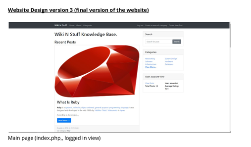

# WikiSite
This wiki site was a wiki site created for my web development module in the second year of university. 

The intention behind this assignment was to create a website using an MVC framework and demonstrating it within site. 

The technology stack for this website is:
* PHP 7
* Code Igniter
* Mysql
* Javascript

## Database Design
 
 
## Site Design
 

## View project
[See the wikisite project on github!](https://github.com/AlexMarriott/WikiSite)
